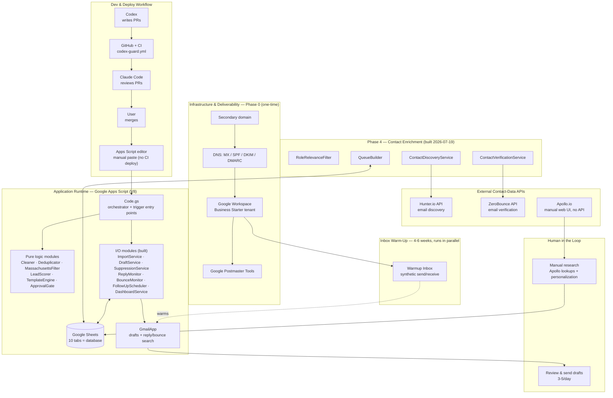

# Project Phases — Express Training Cold Email MVP

## Legend
- 🤖 = Codex (cloud, online — primary coder)
- 🏠 = Human task (manual setup, no code)
- ✅ = Complete  🏗️ = In progress  ⏸️ = Blocked
- 🫡 = Codex built it, merged, Claude review still pending (post-merge review — see CLAUDE.md)

This is a roadmap, not a shared working file — Claude/the user keep it current from the
merged PR list. Codex doesn't edit it. Current task = the first unchecked `- [ ]` box.

---

## Project Stack — high-level overview

Everything below is one project end to end: infrastructure you set up once, the code
Codex/Claude/you ship into it, what actually runs the campaign, and the external services and
humans that feed it. Dashed amber boxes are Phase 4 — planned in `PHASES.md`/`COLD-EMAIL-MONDAY.md`
but not yet built.

---

## Phase 0: Discovery + Manual Setup ✅ 🏠

Architecture and tooling decisions are complete. The following manual setup must be done by the user **before Phase 1 Codex work begins**:

- [x] MVP architecture spec reviewed and approved (`starting-architecture/`)
- [x] Stack chosen: Apps Script + Sheets + Gmail + Warmup Inbox + Apollo/Hunter/ZeroBounce free tiers
- [x] Lean phasing decided: core draft loop first, monitors second, API clients optional
- [x] ✅ 🏠 **Buy secondary cold-outreach domain** (not the primary business domain)
- [x] ✅ 🏠 **Create isolated Google Workspace Business Starter tenant** (separate from primary account)
- [x] ✅ 🏠 **Configure DNS:** MX records, SPF, DKIM, DMARC (`p=none` monitoring mode first)
- [x] ✅ 🏠 **Create sender identity:** real name, profile photo, signature, physical address
- [ ] 🏠 **Connect Warmup Inbox** to the isolated inbox; run 4–6 weeks before first send
- [x] ✅ 🏠 **Configure Google Postmaster Tools** for the new domain
- [x] ✅ 🏠 **Create the Google Sheets file** with the 10 required tabs: SETTINGS, COMPANIES, CONTACTS, CAMPAIGNS, QUEUE, SUPPRESSION, ACTIVITY_LOG, DASHBOARD, TEMPLATES, PLAYBOOK_REQUESTS
- [x] ✅ 🏠 **Create a new Google Apps Script project** bound to the Sheets file; note the script ID
- [ ] 🏠 **Obtain Massachusetts source company list** (CSV) — WTFP grantees and other MA employers
- [ ] 🏠 **Connect Codex to this GitHub repo** (GitHub OAuth, write access to `codex/*` branches only)

*None of these tasks go to Codex. Complete them before sending Task 1.1 brief.*

---

## Phase 1: Core Draft Loop 🤖
*Goal: Build the full pipeline from CSV import through Gmail draft creation, with all 10 pre-send conditions enforced, so the first smoke-test emails can be reviewed and sent by a human.*

- [x] ✅ **Task 1.1** Project scaffold: `appsscript.json`, `src/Code.gs` (orchestrator skeleton), `PROPERTIES.example` (1 PR)
- [x] ✅ **Task 1.2** AuditLogger module: `src/AuditLogger.gs` — structured logging to ACTIVITY_LOG tab (1 PR)
- [x] ✅ **Task 1.3** ImportService module: `src/ImportService.gs` — CSV/paste import to COMPANIES tab (1 PR)
- [x] ✅ **Task 1.4** Cleaner module: `src/Cleaner.gs` — pure normalization of names, domains, cities, titles (1 PR)
- [x] ✅ **Task 1.5** Deduplicator module: `src/Deduplicator.gs` — pure duplicate detection for companies and contacts (1 PR)
- [x] ✅ **Task 1.6** MassachusettsFilter module: `src/MassachusettsFilter.gs` — pure MA-only confirmation (1 PR)
- [x] ✅ **Task 1.7** LeadScorer module: `src/LeadScorer.gs` — pure 100-pt scoring, ≥75 approval gate (1 PR)
- [x] ✅ **Task 1.8** TemplateEngine module: `src/TemplateEngine.gs` — pure template merge with contact fields (1 PR)
- [x] ✅ **Task 1.9** ApprovalGate module: `src/ApprovalGate.gs` — pure check of all 10 pre-send conditions (1 PR)
- [x] ✅ **Task 1.10** DraftService + Code.gs wire-up: `src/DraftService.gs` + `src/Code.gs` updated to run full pipeline (1 PR)
- [x] **CHECKPOINT** ✅ PHASE_READY audit passed (2026-07-03)

*After Phase 1 merge: human manually sends smoke-test emails (3–5/day) from Gmail. DRAFT_ONLY=TRUE is the default.*

---

## Phase 2: Tracking and Follow-ups 🤖
*Goal: Detect replies and bounces, enforce suppression, schedule follow-up drafts, and surface metrics on the DASHBOARD tab.*

- [x] ✅ **Task 2.1** SuppressionService module: `src/SuppressionService.gs` — reads/writes SUPPRESSION tab, `isSuppressed()` check (1 PR)
- [x] ✅ **Task 2.2** ReplyMonitor module: `src/ReplyMonitor.gs` — Gmail search for replies, updates CONTACTS status (1 PR)
- [x] ✅ **Task 2.3** BounceMonitor module: `src/BounceMonitor.gs` — Gmail NDR detection, updates CONTACTS + SUPPRESSION (1 PR)
- [x] ✅ **Task 2.4** FollowUpScheduler module: `src/FollowUpScheduler.gs` — identifies follow-up eligible contacts, adds to QUEUE (1 PR)
- [x] ✅ **Task 2.5** DashboardService + Code.gs trigger wire-up: `src/DashboardService.gs` + `src/Code.gs` updated with monitor + dashboard triggers (1 PR)
- [ ] **CHECKPOINT** 🏠 PHASE_READY audit

*Note: ReplyMonitor and BounceMonitor are the most brittle modules — expect ERRORS.md activity here. Human remains the safety net at this volume.*

---

## Phase 3: API Clients — Optional 🤖
*Goal: Replace manual CSV workflows with API-backed discovery and verification — only if manual enrichment becomes the bottleneck.*

*Trigger: start Phase 3 only when manual CSV processing is consuming too much time or free credits are consistently exhausted.*

- [x] ✅ **Task 3.1** ZeroBounceClient module: `src/ZeroBounceClient.gs` — ZeroBounce email verification API (1 PR)
- [x] ✅ **Task 3.2** ApolloClient module: `src/ApolloClient.gs` — Apollo contact search API (1 PR)
- [x] ✅ **Task 3.3** HunterClient module: `src/HunterClient.gs` — Hunter email finder/verifier API (1 PR)
- [x] ✅ **CHECKPOINT** 🏠 PHASE_READY → Claude Code audit

---

## Phase 4: Contact Enrichment Pipeline ✅ (built by Claude, 2026-07-19)
*Goal: close the gap between a raw `COMPANIES` list and a `QUEUE` ready to draft. Full plan,
timeline, and setup how-tos live in `COLD-EMAIL-MONDAY.md` — this section is the Codex-buildable
task list only.*

*Workflow this pipeline supports: human manually finds a name/title per company in Apollo's web
UI (free, no API) and adds a `CONTACTS` row (company, firstName, lastName, title, linkedinUrl —
email left blank) → Task 4.2 fills in the email via Hunter → Task 4.3 verifies it via ZeroBounce →
Task 4.4 promotes verified, approved contacts into `QUEUE`.*

- [x] ✅ **Task 4.1** RoleRelevanceFilter module: `src/RoleRelevanceFilter.gs` — pure function
  `isRelevantRole(title, keywordsCsv)`; case-insensitive substring match against a comma-separated
  keyword list (e.g. `SETTINGS.RELEVANT_TITLE_KEYWORDS`). No Sheets/API access — same shape as
  `MassachusettsFilter.gs`. (1 PR)
- [x] ✅ **Task 4.2** ContactDiscoveryService module: `src/ContactDiscoveryService.gs` — I/O module,
  `runContactDiscovery()`. Reads `CONTACTS` rows with a blank `email`, looks up the matching
  `COMPANIES` row by company name for the domain, calls `findEmailWithHunter()` (existing
  `HunterClient.gs`, do not modify), and writes back `email`, `catchAll` (derive from Hunter's
  `score`, e.g. `score < 50` → catch-all-risk true), `roleIsRelevant` (via
  `isRelevantRole(title, settings.RELEVANT_TITLE_KEYWORDS)`), `maConfirmed` = `TRUE` (companies in
  `COMPANIES` already passed `isMassachusetts()` at import), `wtfpRelevance` (copy through from the
  `COMPANIES` row), `employeeSizeFit` = `TRUE`, `industryFit` = `TRUE` (MVP default — WTFP source
  list is pre-qualified, no filter logic needed). **Must** read
  `SETTINGS.CONTACT_DISCOVERY_BATCH_SIZE` and process at most that many rows per run (Apps Script
  6-minute execution cap — do not attempt the whole sheet in one call). Every row processed or
  skipped logs via `auditLog('ContactDiscoveryService', ...)`. Add `runContactDiscoveryTrigger()`
  to `Code.gs` (manual-run, not a time trigger — Hunter credits are budget-limited). (1 PR)
- [x] ✅ **Task 4.3** ContactVerificationService module: `src/ContactVerificationService.gs` — I/O
  module, `runContactVerification()`. Reads `CONTACTS` rows with a non-blank `email` and blank
  `verificationResult`, calls `verifyEmailWithZeroBounce()` (existing `ZeroBounceClient.gs`, do not
  modify), writes back `verificationResult` (ZeroBounce `status`) and `catchAll` (`TRUE` when
  ZeroBounce `subStatus` indicates a catch-all domain). **Must** read
  `SETTINGS.CONTACT_VERIFICATION_BATCH_SIZE` and cap rows processed per run, same reasoning as Task
  4.2. Every row logs via `auditLog('ContactVerificationService', ...)`. Add
  `runContactVerificationTrigger()` to `Code.gs` (manual-run). (1 PR)
- [x] ✅ **Task 4.4** QueueBuilder module: `src/QueueBuilder.gs` — I/O module, `buildInitialQueue()`.
  Reads `CONTACTS` rows where `verificationResult === 'valid'`, `roleIsRelevant` is true,
  `maConfirmed` is true, `catchAll` is not true, `emailsSent` is 0/blank, and `isSuppressed(email)`
  (existing `SuppressionService.gs`) is false; skips any contact already present in `QUEUE` (dedupe
  by `contactId`/`email`, same key pattern as `FollowUpScheduler.gs`'s
  `buildFollowUpSchedulerQueueKey_`); appends eligible rows to `QUEUE` with `status = 'QUEUED'`.
  Does **not** re-check `personalizationLine` or daily limits — that is `ApprovalGate`'s job at
  draft time, kept separate on purpose. Add `runQueueBuilderTrigger()` to `Code.gs`, plus a
  convenience `runEnrichmentPipeline()` that chains `runContactDiscovery()` →
  `runContactVerification()` → `buildInitialQueue()` (same pattern as the existing
  `runFullPipeline()`). (1 PR)
- [ ] **CHECKPOINT** 🏠 PHASE_READY audit

---

## Gap Closure — 2026-07-18 (Claude-built) ✅
*Pre-launch gap sweep of the full funnel. All items merged in one PR.*

- [x] ✅ Per-sequence-step templates: `readTemplates`/`selectTemplateForStep` in `Code.gs`; a
  follow-up step with no matching TEMPLATES row is skipped (`FOLLOW_UP_TEMPLATE_MISSING`),
  never silently sent with step-1 content
- [x] ✅ `GeminiClient.gs` (named API client) + `PersonalizationDraftService.gs`: drafts a
  personalization line from the company website into `personalizationDraft` for human review —
  closes the sourced-leads-blocked-by-ApprovalGate deadlock without removing the human gate
- [x] ✅ Per-source bounce metrics in `DashboardService.gs` (`source_*_contacts`,
  `source_*_bounce_rate`) so a bad email source is visible before it hurts the domain
- [x] ✅ Runbook: After a Reply triage, Weekly Deliverability Checklist, Sheet Backup,
  CAN-SPAM template audit, personalization-draft workflow, warm-up taper mechanism

---

## Phase W: Manual Warm-Up Layer (standalone — `manual-email-warmup-gmail/`)
*Goal: supplement Warmup Inbox during the 6–8 week domain ramp with real-engagement warm-up:
Hostinger API sends Gemini-varied emails to 8 owned Gmail seed accounts, which open and reply on
randomized, ramped schedules. Built by Claude directly (not a Codex task). Fully isolated from
the campaign runtime — separate Apps Script project, spreadsheet, Cloud project, credentials.
Strategy source: `Manual_Email_Warmup` research doc (2026-07-17).*

- [x] ✅ **Task W.1** WarmupScheduler: pure ramp/skip/delay/hash math
- [x] ✅ **Task W.2** HostingerMailClient: Email API sends via `UrlFetchApp` (bearer token)
- [x] ✅ **Task W.3** SeedAccountService: per-account Gmail REST access via OAuth refresh tokens
- [x] ✅ **Task W.4** ContentVariationService: Gemini variation with pure local fallbacks
- [x] ✅ **Task W.5** Warmup orchestrator: send/engagement triggers, ENGAGEMENT state, WARMUP_LOG, DAILY_SUMMARY
- [x] ✅ **Task W.6** Tests: `manual-email-warmup-gmail/tests/warmup-logic.test.js`
- [ ] 🏠 **Setup W.a** Warm-up Google Cloud project on a seed Gmail; enable Gmail API; OAuth client
- [ ] 🏠 **Setup W.b** Generate 8 seed-account refresh tokens; store as script properties
- [ ] 🏠 **Setup W.c** Hostinger Email API token; verify send endpoint + test send (headers/DKIM check)
- [ ] 🏠 **Setup W.d** Create warm-up Sheet + Apps Script project; paste files; run `setupWarmupSheet()`; install triggers
- [ ] 🏠 **Setup W.e** Start manual layer in week 2–3 of the Warmup Inbox ramp (see subdir README)

---

## Upgrade Triggers (human decides, not Codex)

| Signal | Action |
|--------|--------|
| ZeroBounce free (100/mo) consistently exhausted | Switch to MillionVerifier or ZeroBounce PAYG credits (~$1–2/300 emails) |
| Apollo free credits exhausted each month | Add Apollo paid plan |
| Manual sending (10/day) is the bottleneck | Evaluate Instantly or Lemlist; drop standalone Warmup Inbox if bundled warm-up included |
| First domain healthy + positive replies confirmed | Add second domain + inbox |
| 150–300 verified contacts ready | Start Phase 3 API clients |
